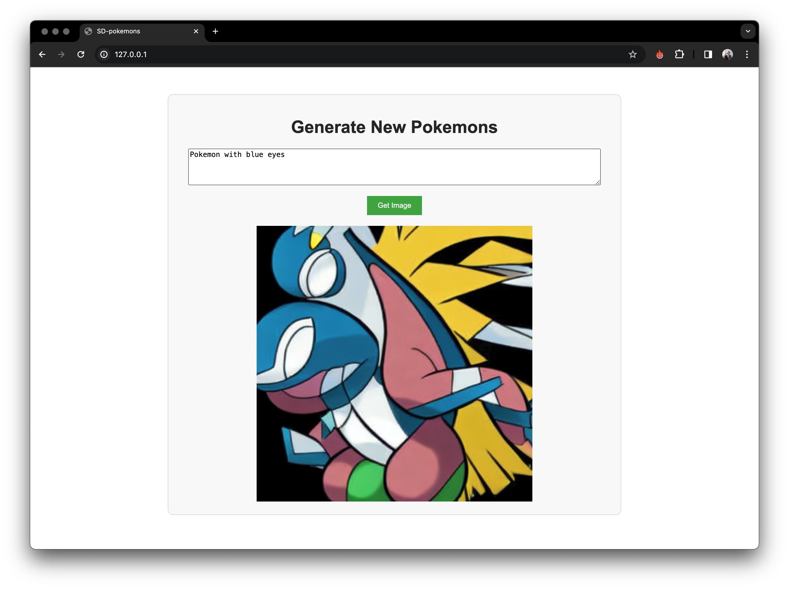

# SD-pokemons
Finetune SD-1.5 to gen new pokemons

## Install
### Venv

```bash
python3.11 -m venv venv
source venv/bin/activate
pip install -r requirements.txt
```

### Weights
Веса для LoRA адаптера лежат по [ссылке](https://drive.google.com/file/d/1uqmLkdfVkmAsyGOSYrdinG3w_7g-F97W/view?usp=sharing), файл с весами переложить в `src/LoRA-pokemons-weights/`

### Data
Все инструкции находятся в папке `data`

## Usage

```bash
python src/app.py
```

### API
Адрес и порт внутри скрипта. Доступно 2 POST запроса к API:

+ **/generate-file** - возвращает изображение `.jpg`
+ **/generate-stream** - возвращает `io.BytesIO()`

Так же по адресу `0.0.0.0:0/` откроется страница для пользовательского взаимодействия с сервисом.

### Front
Мне стало скучно, поэтому я сделал маленький лендинг, чтобы с моделью можно было удобно взаимодействовать с формате привычного сайта. Логика обращения к api находится в `src/front/script.js`

## Model
По сути просто дефолтная **SD-1.5** с **LoRA** адаптером, который натренерован на датасете с покемонами
Как примет качественного рефакторинга **blob** кода во чтото читаемое

### Training

```bash
accelerator --mixed-precision=fp16 launch src/model/train.py
```

Все параметры обучения в файле `src/model/config.py`

[Отчет с Wandb](https://wandb.ai/team24/text2image-fine-tune/reports/LoRA-tune-pokemons--Vmlldzo2NzM0Mzk5)

## Result

